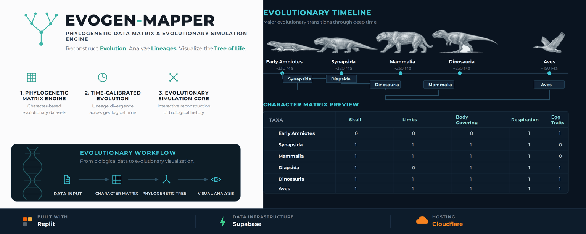

  

# 🧬 Evogen-Mapper

### *Phylogenetic Data Matrix Engine*

> **Evogen-Mapper** is an interactive visualization exploring **phylogenetic data matrices, cladograms, and evolutionary relationships** through dynamic character and taxa management.
>
🧬 **Phylogeny** · 🌳 **Cladistics** · 🌀 **Evolution**

**🔬 [Explore the Simulation](YOUR-LINK-HERE)**

---

## ✦ Features

**📊 Live Data Matrix**  
Create and edit phylogenetic character matrices in real time.

**🌳 Interactive Cladograms**  
Generate dynamic evolutionary trees from matrix data.

**🧬 Taxa Management**  
Add, edit, replace, rename, and reorganize taxa.

**⏳ Evolutionary Timelines**  
Adjust evolutionary timelines through the matrix interface.

**📑 Tabbed Workspace**  
Manage multiple organisms and evolutionary datasets.

**🛠️ Dev Mode**  
Access debugging tools and live trait manipulation for development and testing.

---

## 🧬 Core Concepts

**Phylogenetic Matrices · Taxa · Characters · Cladograms · Evolutionary Relationships · Cladistics**

---

## ⚙️ Technology

**HTML · CSS · JavaScript**

**Database & Assets:** Supabase  
**Repository:** GitHub & Codeberg  
**Hosting:** Cloudflare

---

## 📜 License

Distributed under the **GNU General Public License v3.0 (GPL-3.0)**.
